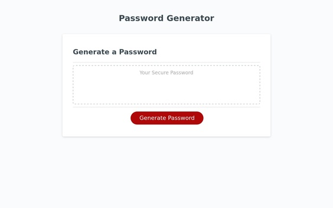

# Password Generator Starter Code

## User Story

```
AS AN employee with access to sensitive data
I WANT to randomly generate a password that meets certain criteria
SO THAT I can create a strong password that provides greater security
```

## Acceptance Criteria

```
GIVEN I need a new, secure password
WHEN I click the button to generate a password
THEN I am presented with a series of prompts for password criteria
WHEN prompted for password criteria
THEN I select which criteria to include in the password
WHEN prompted for the length of the password
THEN I choose a length of at least 8 characters and no more than 128 characters
WHEN asked for character types to include in the password
THEN I confirm whether or not to include lowercase, uppercase, numeric, and/or special characters
WHEN I answer each prompt
THEN my input should be validated and at least one character type should be selected
WHEN all prompts are answered
THEN a password is generated that matches the selected criteria
WHEN the password is generated
THEN the password is either displayed in an alert or written to the page
```

## Webpage

The webpage is structure in a straightforward manner. The box displays the password generated, and the button calls the function to generate that password.

https://chris-backes.github.io/password-generator/



## Javascript Functions

### Global Variables

The global variables can be divided into two groups: arrays which store information to be used by the functions and and variables (some arrays, some not) which store information while the functions get used and use that information later on.

#### Stored Information

These arrays store the characters for upper case, lower case, numerical, and special characters, and get used in building the passwords in two different methods (discussed below).

### The Containing Function: writePassword()

The button on the web page calls a function that contains all the functions necessary for the password to generate.

#### Declared Variables

##### passwordOptions

Stores the contents of the arrays in the above list that the user has determined to include in the constuction of the password.

##### passwordGenerated

Stores the password as iti s being contructed

##### passwordLength

Stores the length of the password

##### answerTicker

Adds 1 to the variable for every yes answer. There is a condiitonal after the prompts to ensure that value is greater than 0 to move forward.

#### passwordLengthPrompt

- Prompts the user for the length of the password
- Verifies the user input is a numeral
- Restarts the function if the user did not input a numeral

#### Array Prompts

charLowerPrompt; charUpperPrompt; charNumbPrompt; charSpecPrompt

Each of these bring up a window.confirm function to select whether the password will include that array. If the user chooses to include the characters of that array, four things happen:

1. passwordOptions absorbs the contents of the respective array
2. passwordGenerated receives on character from the array
3. passwordLength goes down by one
4. answerTicker goes up by one

The second thing that occurs is most relevant here: it happens because it ensures that a member of that array will be included in the password. Later on, when characters are randomly selected from a single arracy including all options, it is not guaranteed that a member of that subset will be included in the password--in fact, in an eight character password, there is about a 36% chance that a numeral will not appear in a password which randomly selects from all subsets. By forcing the inclusion of at least one from each subset here, we ensure the criteria is met.

#### Checking for Positive Responses

If somoene has answered no to all of the Array Prompts, they are told to select at least one option and are routed to the beginning.

#### Password Generation (For Loop)

This add a character from passwordOptions to passwordGenerated by using the function Math.random(). To get to the amount of chacters needed, we subtract the amount of characters added (forcedInputs) from the user defined length (passwordLength) and iterate through the loop an amount eaqual to that number.

#### Jumbling the Password

Because the password's inital characters were input in a not random order, we make some attempt at mixing it up.

#### Converting to string

The password is still being stored as an array, and here we convert it to a string.

#### Copying the password to the web page

The password is the displayed on the browser window

### Remaining features

The remaining features connect the javascript functions to the browser page itself.
